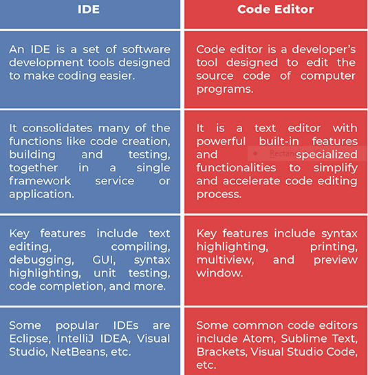

# Modern JavaScript For Everyone:Mastering Modern JavaScript The Right Way.

## Introduction


JavaScript was introduced in 1995 as its was to add program to web pages in the Netcape Navigator browser.

Its important to note that JavaScript has nothing to do with java programming language,the similar name was being inspired by marketing considerarions.

JavaScript cannot only be used in web browser, some database such as Mongo DB and CouchDB use JavaScript as their scripting and query language.


## Code Editor For JavaScript

### What Is Code Editor?

Code editor is one of the essential tools for programmers,designers and even writers designed to edit the source code of computer programs.

A code editor is besically a text editor but it is also designed to help you write code.

### What Is An IDE ?

Its a shorthand for *Intergrated Development*,is one of the most powerful programmning tools that combine the different aspects of computer program into a single GUI.

<!--A PIC OF CODE EDITOR -->


JavaScript programmers have many good tools to chose from but I would recommend the two below:
 
  1. Visual Studio Code [Download Link](https://code.visualstudio.com/download)

  2. Sublime Text [Download Link](https://www.sublimetext.com/3)

  Why would you use a code editor instead of an IDE,would say because of speed.

  JavaScript can can be written in two ways in your HMTL code:

  ### Internal JavaScript 

  JavaScript can be used together with the html elements inside HTML file as shown below.

  <!--code for internal javascript-->

  ```js
  <script>
  document.getElementById('work')
  </script>
  ```

  ### External JavaScript

  JavaScript can also be placed in an external file,this file will be containing JavaScript script.

  <!--code for external javascript-->

  ```js
  <!DOCTYPE html>
  <html>
  <body>
  <script src="path to your javascript file">
  </body>
  </html>
  ```


  ### Advantages Of External JavaScript

  Placing the JavaScript externally has the following advantages:
   
     .It seperates JavaScript code and html code.
     .It easier to read.
     .It speed up the page.


## JavaScript Fundamentals

Learn modern JavaScript the righr way require one to have better understanding of basics of JavaScript.

Below are basics you  need to consider when learning JavaScript:
 
   .Data types
   
   .Function

   .Keywords

   .Variable

   .Comments

   .Arrays

   ### Data Types

   JavaScript variable can hold many data types:
    
     .String - a character or a string of characters.

     .Number - an integer or floating point number.

     .Boolean - a value with true of false.

     .Function - a user defined method.

     .Objects - a built-in or user-defined objects.

     
### Function

A function is a code block that can repeat to run many times. To define a function,use function-name.

 Function is exercuted when something calls it.

 <!--code for function-->

 ```js
 function myFunction (p1,p2){
     return p1 * p2;
 }
 ```


 ### Function Syntax

 JavaScript function is defined with function keyword,followed by a name then parenthesis ().

 Function names can contain letters,digits,underscores and dollar signs.


### Keywords

Keywords belong to JavaScript itself. The following are examples of JavaScript keyword:

.Break

.Return

.False

.Typeof

.With

.Forms

### Variables

Variable is a symbolic name associated with a value. They are containers for storing data values.

<!--code for variable-->

```js

var x = 10;

var y = 14;

var z = y * x;

```


### Comments 

Comments in JavaScript can be used to explaining JavaScript code and also prevent exercution,when testing alternative code.

There are two type of comment in JavaScript.

#### Single Line Comments

They start with //.

Code that comes before // will not be exercuted.


`// This is single line comment`

#### Multi-Line Comments

They start with /* and end with */.

Any code between /* and */ will not be exercuted.

```js
/* This is a multi-line comment
*/
```

### Arrays

Arrays in JavaScript are used to store multiple value in a single variable. new Array() will create an array.

<!--code for array-->

```js

var array-name = new Array ("value1","value2","value3");

```

Showing an array element values we use the following syntax.

<!--code to show the array element-->

```js

document.write (array-name[index]);

```

Getting the size of an array.

<!--code for size of an array-->

` array.length`


## References

Below are some of the books that can help you in your journey to master JavaScript.

1. Eloquent JavaScript by *Marijn Haverbeke*

2. JavaScript In 8 Hours by *Yao Ray* 


